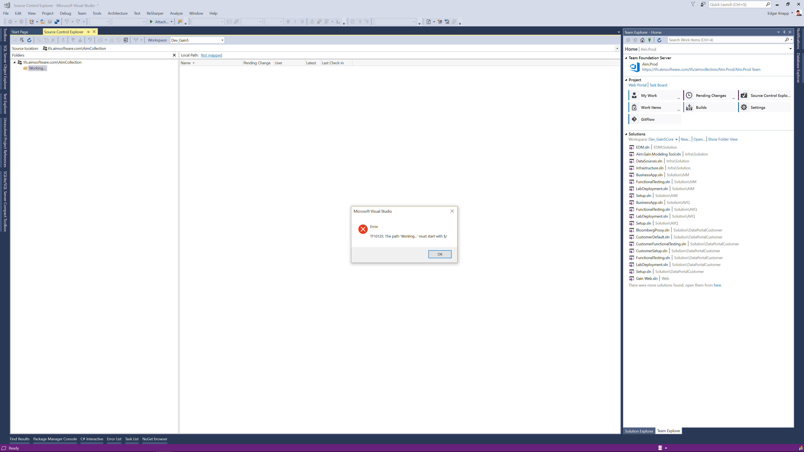

# LocateFolder

<!-- Replace this badge with your own-->

<!-- Update the VS Gallery link after you upload the VSIX-->
Download this extension from the [VS Gallery](https://visualstudiogallery.msdn.microsoft.com/[GuidFromGallery])
or get the [CI build](http://vsixgallery.com/extension/48d3bf5a-f247-4587-ab35-d47a1aff2add/).

---------------------------------------

Locate Files and Fiolders in Windows Explorer

See the [change log](CHANGELOG.md) for changes and road map.

## Features

- Right-Click any file or folder in Solution Explorer and chosse Open in Explorer ot open the item in Explorer

### Feature 1
Describe feature 1. Add screenshots/code samples etc.

### Feature 2
Describe feature 2. Add screenshots/code samples etc.

#### Sub feature
Describe sub feature. Add screenshots/code samples etc.

## Contribute
Check out the [contribution guidelines](CONTRIBUTING.md)
if you want to contribute to this project.

For cloning and building this project yourself, make sure
to install the
[Extensibility Tools 2015](https://visualstudiogallery.msdn.microsoft.com/ab39a092-1343-46e2-b0f1-6a3f91155aa6)
extension for Visual Studio which enables some features
used by this project.

## License
[Apache 2.0](LICENSE)